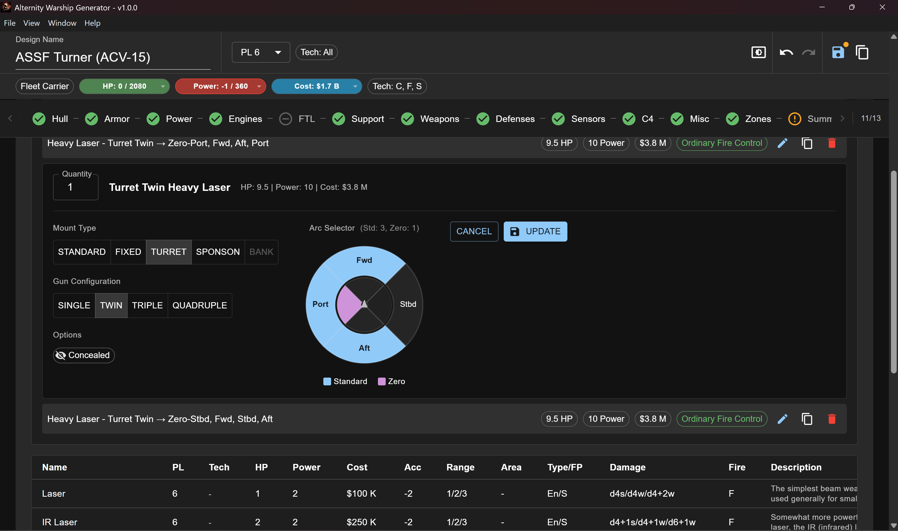

# Alternity Warship Generator

A desktop application for generating Warships for the **Alternity** sci-fi tabletop role-playing game. The app implements the ship construction rules from the "Warships" sourcebook by Richard Baker.



## Features

- **Step-by-step warship building** - Guided wizard similar to character creation
- **Complete ship construction** - Hull, armor, power plants, engines, FTL drives, weapons, defenses, sensors, command & control, and more
- **Progress Level & Tech Track filtering** - Design constraints to limit available components
- **Damage diagram editor** - Assign systems to damage zones with hit location chart
- **Ordnance design** - Create custom missile, bomb, and mine designs
- **PDF export** - Generate printable ship sheets
- **Save/Load** - Save your designs to `.warship.json` files
- **Externally editable data** - Customize game data (hulls, weapons, etc.) via JSON files

## Download

Download the latest installer from the [Releases page](https://github.com/VicenteCartas/AlternityWarshipsGenerator/releases).

- **Windows:** `Alternity.Warship.Generator.Setup.X.X.X.exe`
- **macOS:** `Alternity.Warship.Generator-X.X.X.dmg`
- **Linux:** `Alternity.Warship.Generator-X.X.X.AppImage`

## Development

### Prerequisites

- Node.js 20.19+ or 22.12+ (recommended)
- npm

### Install Dependencies

```bash
npm install
```

### Development Mode

To run the app in development mode with hot-reload:

```bash
npm run dev:electron
```

This starts both the Vite dev server and Electron. Changes to React code will hot-reload instantly.

**Alternative:** If you want to run them separately (useful for debugging):

```bash
# Terminal 1: Start Vite dev server
npm run dev

# Terminal 2: Start Electron (after Vite is ready)
npm run electron:start
```

### Build for Production

```bash
# Build the app
npm run build:electron

# Create platform-specific installers
npm run dist:win     # Windows installer (.exe)
npm run dist:mac     # macOS disk image (.dmg)
npm run dist:linux   # Linux AppImage
npm run dist:all     # All platforms
```

The installers will be created in the `release/` folder.

> **Note:** macOS builds created on Windows will be unsigned and may show security warnings. For proper macOS distribution, build on a Mac with code signing.

## Available Scripts

| Command | Description |
|---------|-------------|
| `npm run dev` | Start Vite dev server only (web preview at http://localhost:4200) |
| `npm run dev:electron` | Start Vite + Electron together for desktop development |
| `npm run electron:start` | Start Electron only (requires Vite to be running) |
| `npm run build` | Build React app for production |
| `npm run build:electron` | Build both React and Electron for production |
| `npm run dist:win` | Create Windows installer |
| `npm run dist:mac` | Create macOS disk image |
| `npm run dist:linux` | Create Linux AppImage |
| `npm run dist:all` | Create installers for all platforms |
| `npm run lint` | Run ESLint |

## Project Structure

```
├── electron/           # Electron main process code
│   ├── main.ts         # Main process entry point
│   ├── preload.ts      # Preload script for IPC
│   └── tsconfig.json   # TypeScript config for Electron
├── scripts/            # Build scripts
├── src/
│   ├── components/     # React components for each build step
│   ├── constants/      # Shared constants and styling
│   ├── data/           # JSON game data files (hulls, weapons, etc.)
│   ├── services/       # Business logic and calculations
│   ├── types/          # TypeScript type definitions
│   ├── App.tsx         # Main React component with stepper/wizard
│   └── main.tsx        # React entry point
├── public/             # Static assets (logo, etc.)
```

## Customizing Game Data

The game data (hulls, armor, power plants, weapons, etc.) is stored in JSON files that can be edited:

- **In development:** Files are in `src/data/`
- **In production:** Files are copied to `resources/data/` alongside the app

Users can modify these files to add custom hulls, adjust costs, create new weapons, etc. Changes require an app restart to take effect.

## Creating a Release

Releases are automated via GitHub Actions. To create a new release:

1. **Update the version** in `package.json`:
   ```json
   "version": "0.2.0"
   ```

2. **Commit and tag** the release:
   ```bash
   git add -A
   git commit -m "Release v0.2.0"
   git tag v0.2.0
   git push origin main --tags
   ```

3. **GitHub Actions will automatically:**
   - Build installers for Windows, macOS, and Linux
   - Create a GitHub Release
   - Attach all installers for download

The release will appear on the [Releases page](https://github.com/VicenteCartas/AlternityWarshipsGenerator/releases) within a few minutes.

## Tech Stack

- **Electron** - Desktop app framework
- **React 18** - UI library
- **TypeScript** - Type safety
- **Material-UI (MUI) v6** - UI component framework
- **Vite** - Fast build tool with HMR
- **jsPDF** - PDF generation

## License

This project is licensed under the MIT License - see the [LICENSE](LICENSE) file for details.

## Disclaimer

This is a fan-made tool. Alternity is a trademark of Wizards of the Coast. This project is not affiliated with or endorsed by Wizards of the Coast.  
This tool has only been tested at 4K resolution. It is very data dense, so it will probably not look good at smaller resolutions. I will try to address those issues but it will never work great on smaller screens.  
I have not tested Mac/Linux builds as I don't have accesss to a machine with those OS.  
Visual Studio Copilot + Claude were used to develop this tool.
