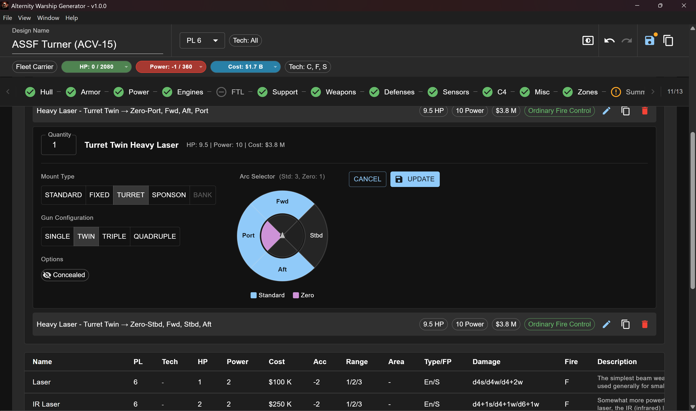

# Alternity Warship Generator

A desktop application for generating Warships, Space Stations, and Bases for the **Alternity** sci-fi tabletop role-playing game. The app implements the construction rules from the "Warships" sourcebook by Richard Baker.



## Features

### Ship & Station Design

- **Step-by-step building wizard** — Guided workflow for warships, space stations, ground bases, and outposts
- **Complete ship construction** — Hull, armor, power plants, engines, FTL drives, weapons, defenses, sensors, command & control, hangars, and more
- **Stations & Bases** — Full support for space stations, ground bases (with breathable atmosphere / natural gravity), and outposts. Each type has its own step list and rules
- **Progress Level & Tech Track filtering** — Design constraints that filter available components across all steps
- **Ordnance design** — Create custom missile, bomb, and mine designs with export/import for reuse across ships
- **Weapon magazines** — Data-driven magazine system for accelerators, bomb projectors, tunneling drivers, and modded weapons
- **Carrier complement** — Assign saved small-craft designs to hangars and docking clamps with rule validation and cost rollup
- **Defense & FTL splitting** — Split fixed-coverage screens and FTL drives into sub-sections for damage zone assignment on large hulls
- **Damage diagram editor** — Smart auto-assign with spatial scoring, drag-and-drop, and keyboard shortcuts

### Mod System

- **Full mod support** — Create mods that add or replace any component from the game data
- **Mod Manager UI** — Enable, disable, reorder, duplicate, and validate mods
- **Custom tech tracks** — Mods can define new technology tracks that equipment can reference
- **Total conversions** — Replace all base data for a completely custom setting

### Export & Library

- **PDF export** — technical readout style ship sheets with lore, systems detail, combat tables, and damage zones
- **Copy stats to clipboard** — Formatted text for forums, Discord, or campaign docs
- **Ship Library** — Browse and search saved designs with thumbnail cards, filter by name/class/PL
- **Save/Load** — Save designs to `.warship.json` files with automatic migration of older formats

### Quality of Life

- **Undo/Redo** — Full history for all design changes (Ctrl+Z / Ctrl+Y)
- **Auto-save & crash recovery** — Periodic auto-save with recovery prompt on relaunch
- **Clone design** — Duplicate the current design to create variants
- **Light/Dark theme** — System preference detection with manual override
- **Keyboard shortcuts** — Shortcuts for common operations with a help dialog
- **Budget visualization** — Bar charts showing HP, power, and cost allocation by category
- **Validation warnings** — Fire control, sensor control, power deficit, and dependency warnings
- **Externally editable data** — Customize game data via JSON files in the app's resources folder

## Download

Download the latest installer from the [Releases page](https://github.com/VicenteCartas/AlternityWarshipsGenerator/releases).

- **Windows:** `Alternity.Warship.Generator.Setup.X.X.X.exe`
- **macOS:** `Alternity.Warship.Generator-X.X.X.dmg`
- **Linux:** `Alternity.Warship.Generator-X.X.X.AppImage`

## Development

### Prerequisites

- Node.js 20.19+ or 22.12+ (recommended)
- npm

### Install Dependencies

```bash
npm install
```

### Development Mode

To run the app in development mode with hot-reload:

```bash
npm run dev:electron
```

This starts both the Vite dev server and Electron. Changes to React code will hot-reload instantly.

**Alternative:** If you want to run them separately (useful for debugging):

```bash
# Terminal 1: Start Vite dev server
npm run dev

# Terminal 2: Start Electron (after Vite is ready)
npm run electron:start
```

### Build for Production

```bash
# Build the app
npm run build:electron

# Create platform-specific installers
npm run dist:win     # Windows installer (.exe)
npm run dist:mac     # macOS disk image (.dmg)
npm run dist:linux   # Linux AppImage
npm run dist:all     # All platforms
```

The installers will be created in the `release/` folder.

> **Note:** macOS builds created on Windows will be unsigned and may show security warnings. For proper macOS distribution, build on a Mac with code signing.

## Available Scripts

| Command | Description |
|---------|-------------|
| `npm run dev` | Start Vite dev server only (web preview at http://localhost:1537) |
| `npm run dev:electron` | Start Vite + Electron together for desktop development |
| `npm run electron:start` | Start Electron only (requires Vite to be running) |
| `npm run build` | Build React app for production |
| `npm run build:electron` | Build both React and Electron for production |
| `npm run dist:win` | Create Windows installer |
| `npm run dist:mac` | Create macOS disk image |
| `npm run dist:linux` | Create Linux AppImage |
| `npm run dist:all` | Create installers for all platforms |
| `npm run lint` | Run ESLint |
| `npm run test` | Run all tests |
| `npm run test:watch` | Run tests in watch mode |
| `npm run test:coverage` | Run tests with coverage report |

## Project Structure

```
├── electron/           # Electron main process code
│   ├── main.ts         # Main process entry point
│   ├── preload.ts      # Preload script for IPC
│   └── tsconfig.json   # TypeScript config for Electron
├── scripts/            # Build scripts
├── src/
│   ├── components/     # React components for each build step
│   │   ├── shared/     # Reusable UI components
│   │   ├── summary/    # Summary sub-components
│   │   └── library/    # Ship Library components
│   ├── constants/      # Shared constants and styling
│   ├── data/           # JSON game data files (hulls, weapons, etc.)
│   ├── hooks/          # Custom hooks (state, save/load, undo, auto-save)
│   ├── services/       # Business logic and calculations
│   ├── test/           # Test utilities and mocks
│   ├── types/          # TypeScript type definitions
│   ├── App.tsx         # Main React component with stepper/wizard
│   └── main.tsx        # React entry point
└── public/             # Static assets (logo, etc.)
```

## Customizing Game Data

The game data (hulls, armor, power plants, weapons, etc.) is stored in JSON files that can be edited:

- **In development:** Files are in `src/data/`
- **In production:** Files are copied to `resources/data/` alongside the app

Users can modify these files to add custom hulls, adjust costs, create new weapons, etc. Changes require an app restart to take effect.

## Creating a Release

Releases are automated via GitHub Actions. To create a new release:

1. **Update the version** in `package.json`:
   ```json
   "version": "0.2.0"
   ```

2. **Commit and tag** the release:
   ```bash
   git add -A
   git commit -m "Release v0.2.0"
   git tag v0.2.0
   git push origin main --tags
   ```

3. **GitHub Actions will automatically:**
   - Build installers for Windows, macOS, and Linux
   - Create a GitHub Release
   - Attach all installers for download

The release will appear on the [Releases page](https://github.com/VicenteCartas/AlternityWarshipsGenerator/releases) within a few minutes.

## Tech Stack

- **Electron 40** — Desktop app framework
- **React 19** — UI library
- **TypeScript 5.9** — Type safety
- **Material-UI (MUI) v7** — UI component framework
- **Vite 7** — Fast build tool with HMR
- **Vitest** — Testing framework
- **jsPDF** — PDF generation

## License

This project is licensed under the MIT License - see the [LICENSE](LICENSE) file for details.

## Disclaimer

This is a fan-made tool. Alternity is a trademark of Wizards of the Coast. This project is not affiliated with or endorsed by Wizards of the Coast.

This tool is optimized for desktop-sized screens. It is very data dense, so smaller resolutions may not provide the best experience.  
Mac and Linux builds are provided but have not been extensively tested.  
Visual Studio Copilot + Claude were used to develop this tool.
